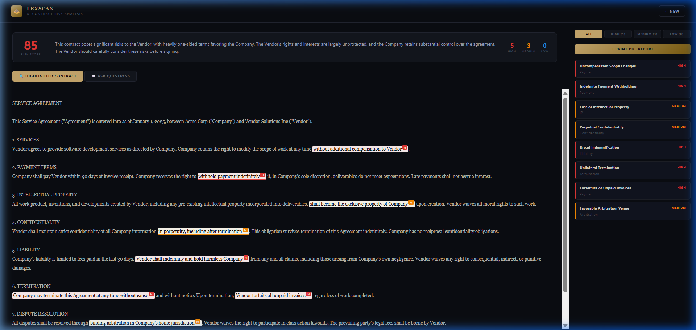
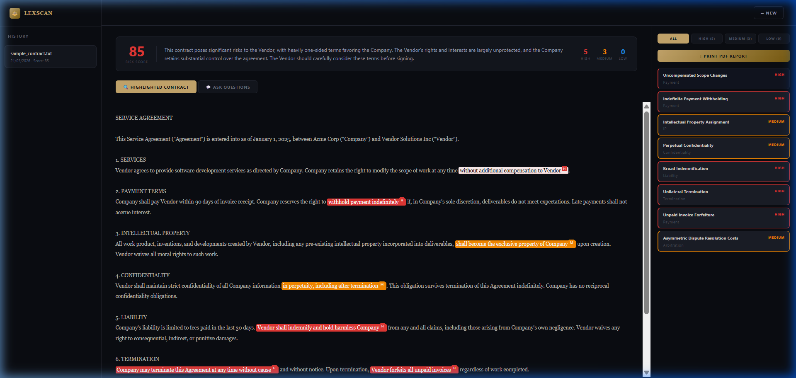

```text
██╗     ███████╗██╗  ██╗███████╗ ██████╗ █████╗ ███╗   ██╗
██║     ██╔════╝╚██╗██╔╝██╔════╝██╔════╝██╔══██╗████╗  ██║
██║     █████╗   ╚███╔╝ ███████╗██║     ███████║██╔██╗ ██║
██║     ██╔══╝   ██╔██╗ ╚════██║██║     ██╔══██║██║╚██╗██║
███████╗███████╗██╔╝ ██╗███████║╚██████╗██║  ██║██║ ╚████║
╚══════╝╚══════╝╚═╝  ╚═╝╚══════╝ ╚═════╝╚═╝  ╚═╝╚═╝  ╚═══╝
```

<p align="center">
  
  
  
  
  
  
  
  
</p>

# LexScan: AI Contract Risk Highlighter

LexScan is an advanced AI-powered legal technology application designed to instantly analyze contracts, highlight critical risks, and provide conversational Q&A capabilities directly on document text.

---
## Features

- OCR-based extraction for scanned contracts (`.jpg`, `.png`) using Tesseract.js web workers.
- Server-Sent Events streaming for real-time risk analysis.
- Persistent document history using localStorage.
- Fuzzy-matched clause highlighting within the document viewer.
- Secure backend proxy for API key protection.
- Simultaneous frontend and backend startup using concurrently.

## Tech Stack

| Category | Technology |
|---------|------------|
| Frontend | React, TypeScript, Vite |
| Backend | Node.js, Express |
| AI Engine | Groq (llama-3.3-70b-versatile) |
| OCR | Tesseract.js |
| Document Parsing | PDF.js, Mammoth.js |

## Quick Start

### Environment Variables

Create a `.env.local` file:

```env
VITE_GROQ_API_KEY=gsk_your_private_groq_key_here
```

### Install Dependencies

```bash
npm install
```

### Run the Application

```bash
npm run dev
```

This command launches:
- Backend: `http://localhost:3001`
- Frontend: `http://localhost:3005`

## Interface Previews

### Visual Risk Highlights



### Offline Document History



## Security

The `.env.local` file is excluded through `.gitignore`. The backend proxy prevents exposing Groq API credentials to the client application.
